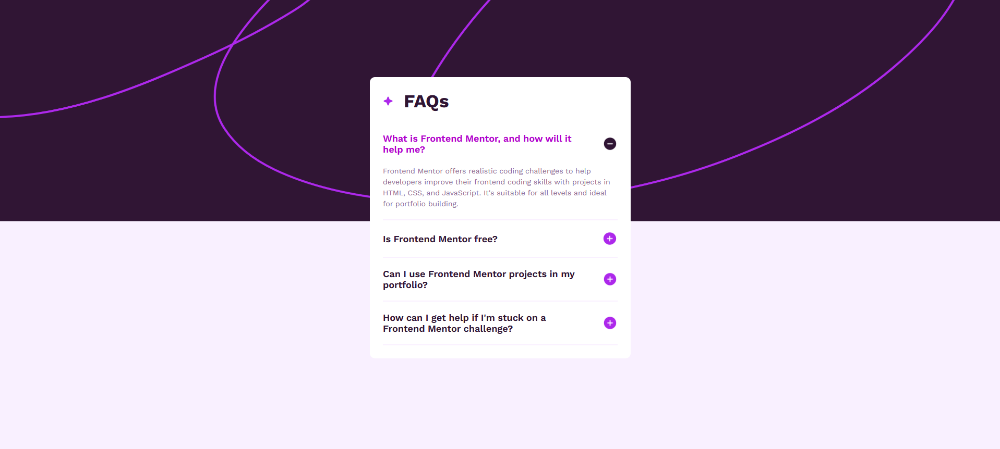

# Blog preview card

The goal of this exercise was to create an accordion component that adapts to different device sizes, ranging from mobile phones to desktop computers. It displays a questions and answers component where the user can interact with it, expanding or collapsing the content.

## Table of contents

- [Overview](#overview)
  - [The challenge](#the-challenge)
  - [Screenshot](#screenshot)
  - [Links](#links)
- [My process](#my-process)
  - [Built with](#built-with)
  - [Installation Steps](#installation-steps)
  - [Useful resources](#useful-resources)
- [Author](#author)

## Overview

### The challenge
- Design and implement a responsive Accordion Card component that displays a preview of an article about HTML and CSS foundations, including a featured image.
- Ensure hover and focus states are implemented for all interactive elements.

### Screenshot

_If the image is not visible, please check the file path or ensure the screenshot exists._

### Links

- [Live Site](https://faq-accordion-one-alpha.vercel.app/) - View the live version of the FAQs Accordion.

## My process

### Built with

- Mobile-first workflow
- [Sass](https://nextjs.org/docs/app/building-your-application/styling/sass) - Sass for styling
- [React](https://reactjs.org/) - TS library
- [Next.js](https://nextjs.org/) - React framework

### Installation Steps

  #### 1. Clone the repository (if you haven't already)
    git clone git@github.com:nmelissarp/faq-accordion.git
  #### 2. Navigate to the project folder
    cd faq-accordion
  #### 3. Install dependencies
    npm install
  #### 4. Run the development server
    npm run dev
  #### 5. Verify the application Open your browser and navigate to http://localhost:3000 to ensure everything is working as expected.

### Useful resources

- [Sass in Next.js Official Docs](https://nextjs.org/docs/app/building-your-application/styling/sass) - This official guide covers setting up and using Sass with Next.js, including configuration, best practices, and applying styles in your components.
- [How to use sass in Next.js](https://medium.com/@farihatulmaria/how-to-integrate-css-and-sass-in-next-js-6264e75bc268) - A helpful guide for learning how to style with Sass and apply it to your components. Great for beginners.
- [How to integrate Next.js Sass for scalable Web applications](https://www.dhiwise.com/post/how-to-integrate-nextjs-sass-for-scalable-web-applications) - A detailed guide on integrating Sass with Next.js, covering setup, configuration, and best practices for scalable web applications.

## Author

- [Melissa Ramírez](https://www.linkedin.com/in/nmelissarp/) - Developer and enthusiast of web development, always learning and experimenting with new technologies.
